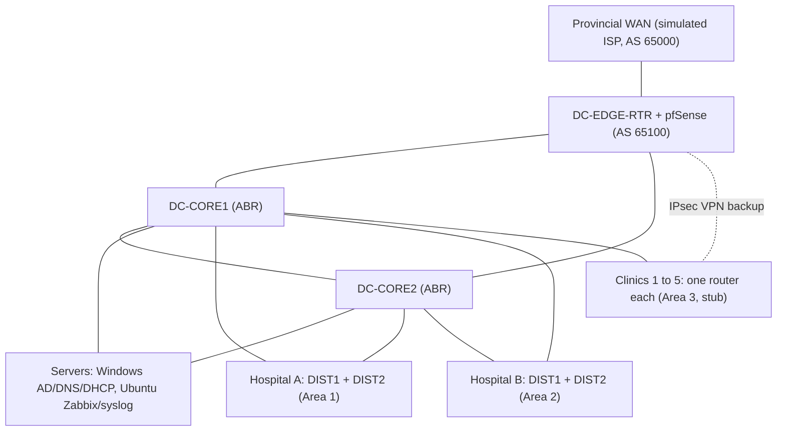

# Topology

## Reading the diagram
- Solid lines are primary links. The dashed line is the backup path from each clinic over broadband and IPsec.
- DC-CORE1/2 act as OSPF area border routers and summarize each area toward the backbone.
- Hospitals have a distribution pair running HSRP. Clinics have a single router plus switch and access point.
